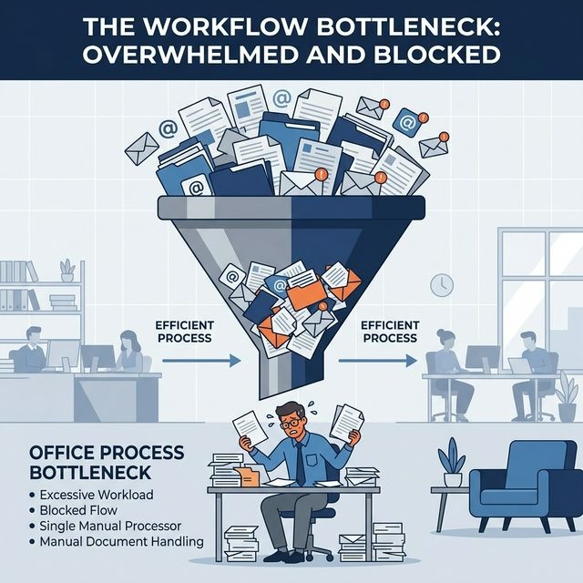
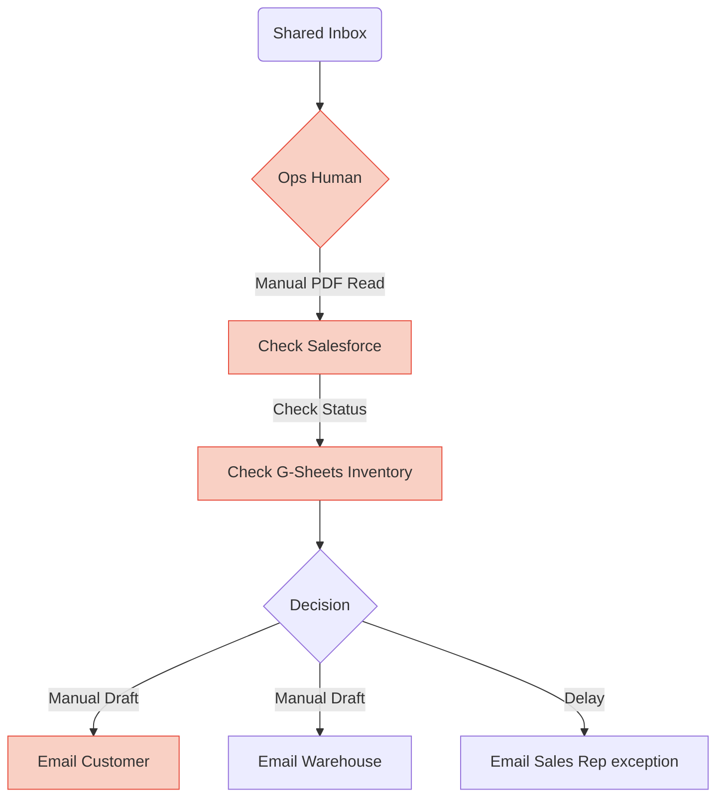
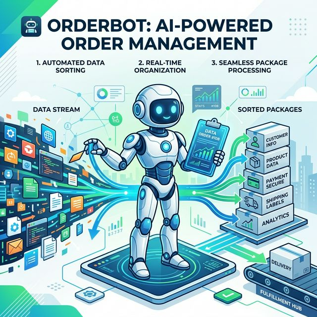
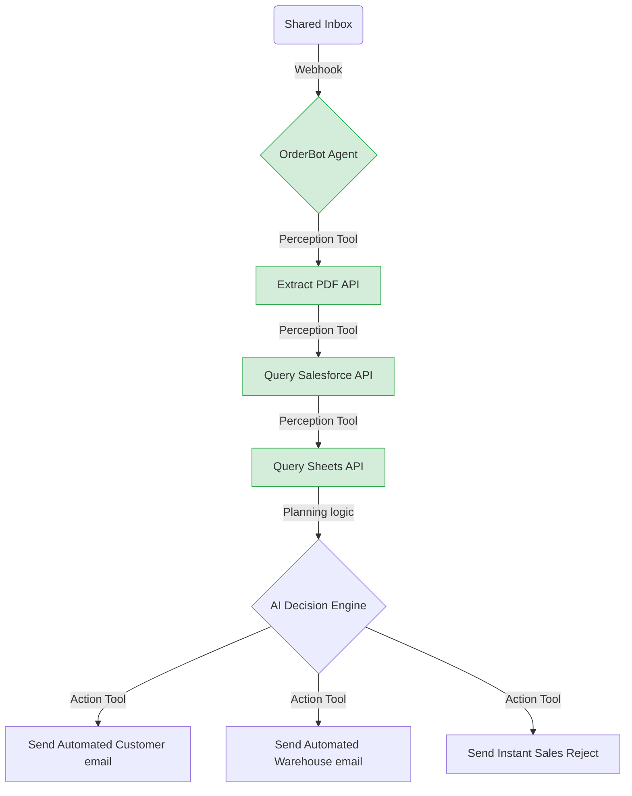
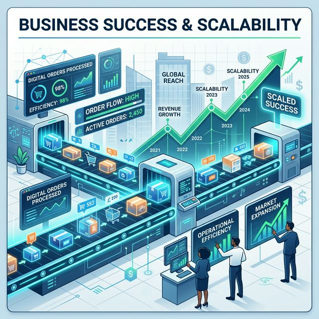

# OrderBot AI: Automating Fulfillment
**Prepared for the Head of Operations**

---

## Slide 1: The Problem - Our Current Order Process Is a Bottleneck

The manual intervention required for every incoming order slows us down and scales poorly.

**Pain Points Identified:**
- **Manual Data Entry:** Reading PDFs leads to high overhead and transcription errors.
- **Context Switching:** Bouncing between Email, Salesforce, and Sheets disrupts focus.
- **Long Delays:** Problematic orders bottleneck in an operations inbox rather than bouncing back to Sales instantly.

### Current Process Flow

---

## Slide 2: The Solution - Introducing 'OrderBot'

OrderBot is an **Autonomous AI Agent** that connects directly to our systems via API tools to instantly execute the decision tree 24/7.

**Architecture Overview:**
- **Goal:** Autonomously process 100% of new hardware orders within 5 minutes at 99.5% accuracy.
- **Perception (Tools):** Inbox API, PDF Parsing Tool, Salesforce API, Google Sheets API.
- **Planning:** Parse -> Query -> Decide -> Act.
- **Action (Tools):** Automated Email Sender, Salesforce Updater, Sheets Decrement.
- **Memory/Learning:** Logging outcomes to flag consistently problematic sales reps for human review.

### OrderBot Process Flow

---

## Slide 3: Business Impact & Recommended Next Steps

### Target Business Outcomes
- **Reduced Costs:** Operations staff time drops from 10 minutes per order to 0.
- **Speed:** SLA drops from hours/days to < 5 minutes.
- **No Errors:** System-to-system translation guarantees 99.5% accuracy.
- **Scale:** Unlimited throughput during peak sales seasons.

### Recommended Next Steps
We propose a low-risk, gradual integration approach to ensure trust and accuracy:
1. **Phase 1: Read-Only PoC (2 weeks)**
   Deploy OrderBot to "Shadow Mode" to passively read emails and draft responses without actually sending them. Operations humans verify the drafts for accuracy.
2. **Phase 2: Hybrid Rollout**
   OrderBot handles unambiguous "Happy Path" orders autonomously; exceptions or edge-cases route to humans.
3. **Phase 3: Autonomous Tuning**
   Enable Memory components so OrderBot proactively coaches sales reps on bad PDF forms.
